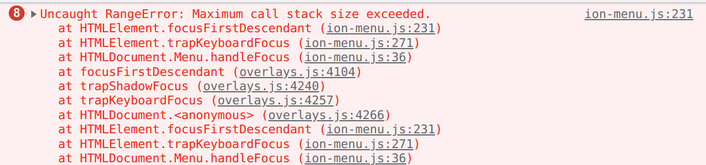
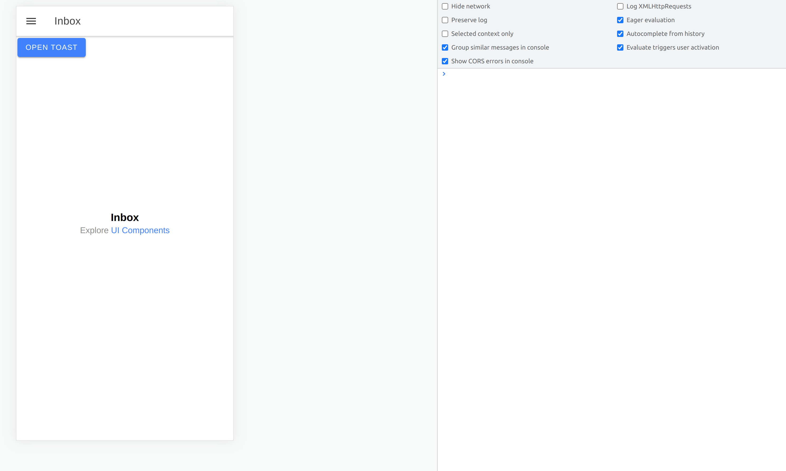
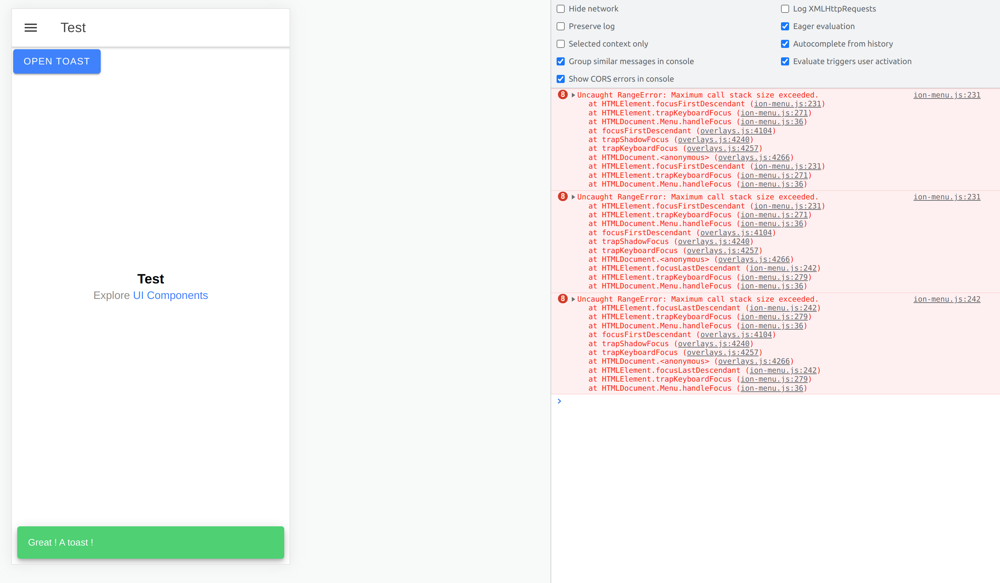

# ionic_toast_error

Repository to repoduce the following error :

Just clone this repo and launch the following commands :

`npm install`

`ionic serve`

Click on the blue button "Open Toast" then open the sidemenu and click on another link to see a new page. 

You should see the error pop out to the browser console. 

